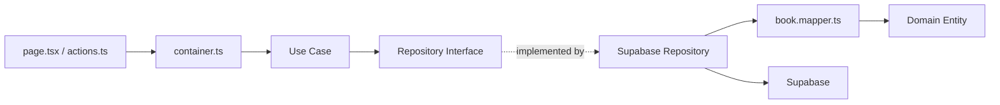
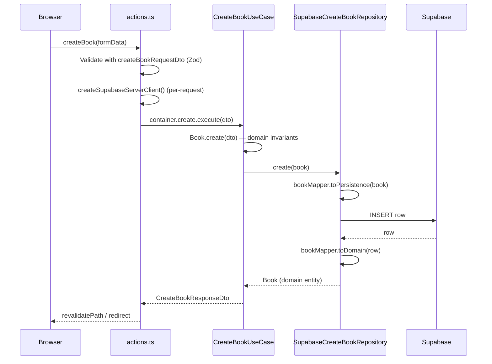

# Architecture Overview

## Clean Architecture Layers

```
src/
├── domain/                        # Pure business logic, zero framework deps
│   └── entities/
│       ├── book.entity.ts         # Domain entity (Book class, factory + invariants)
│       ├── book.schema.ts         # Zod invariant schemas (source of truth for validation)
│       └── errors.ts              # Domain errors (BookNotFoundError, InvalidBookError, etc.)
│
├── application/                   # Application logic, one folder per use case
│   └── use-cases/
│       └── books/
│           └── create-book/
│               ├── create-book.use-case.ts            # class CreateBookUseCase { execute() }
│               ├── create-book.repository.interface.ts # interface — use case depends on this, not the impl
│               ├── create-book.request.dto.ts         # Zod schema + z.infer type (input contract)
│               └── create-book.response.dto.ts         # Plain type (output contract — not Zod)
│
├── infrastructure/                # External concerns (DB, APIs)
│   └── database/
│       └── postgres/
│           ├── database.types.ts # Supabase generated types (do not edit)
│           ├── entities/         # DB row type aliases (one per entity)
│           │   └── book.entity.ts
│           ├── mappers/          # Flat, one file per entity. Reused by every repo that touches the entity.
│           │   └── book.mapper.ts # toDomain(row) + toPersistence(book)
│           └── repositories/     # Repository implementations (implement use-case interfaces)
│               └── books/
│                   └── supabase-create-book.repository.ts
│
└── lib/                           # Cross-cutting wiring + shared infra
    ├── containers/               # DI wiring (connects use cases to concrete repos)
    │   └── books.container.ts
    └── shared/
        └── infrastructure/
            ├── env.ts             # Env validation — throws if missing (no defaults)
            ├── supabase.server.ts  # Per-request server client (cookies())
            ├── supabase.browser.ts # Browser client (createBrowserClient)
            └── auth.server.ts      # (future) getUser(), requireUser() helpers
```

## Layer Responsibilities

| Layer              | Location                          | Responsibility                                          |
| ------------------ | --------------------------------- | ------------------------------------------------------- |
| **Domain**         | `domain/entities/`                | Entity classes with business rules + Zod invariant schemas. Zero framework deps. |
| **Application**    | `application/use-cases/`          | One class per use case. Repository interfaces, request DTOs (Zod), response DTOs (plain types). |
| **Infrastructure** | `infrastructure/database/postgres/` | Supabase repository implementations, DB row type aliases, mappers (one per entity, flat). |
| **Container**      | `lib/containers/`                | Wires use cases with concrete repositories. Takes a Supabase client. |
| **Shared Infra**   | `lib/shared/infrastructure/`      | Supabase server/browser clients, env validation, auth helpers. |
| **Delivery**       | `src/app/{feature}/`             | Next.js Server Components (`page.tsx`), Server Actions (`actions.ts`), UI components. |

## Dependency Rules

- Domain has **zero** external imports — no Supabase, no Next.js, no `@supabase/ssr`. Only `zod` (for invariant schemas) and your own entity classes.
- Use Cases depend on repository **interfaces**, never concrete implementations.
- Repository interfaces live in `application/use-cases/{use-case}/` alongside the use case.
- Infrastructure depends on Domain (for entity classes) and `infrastructure/database/postgres/` (for DB types).
- Delivery layer (`src/app/`) imports only the container function and DTOs — never repositories or use cases directly.
- Mappers are **flat, one per entity** — `infrastructure/database/postgres/mappers/{entity}.mapper.ts`. Any repo that touches that entity imports the same mapper. Never nest mappers by relationship.



## Dependency Injection

The Supabase server client is created **per-request** using `cookies()` from `next/headers`, and passed to the container in `actions.ts`:

```ts
// src/app/books/actions.ts
"use server";
import { createSupabaseServerClient } from "@/lib/shared/infrastructure/supabase.server";
import { createBooksContainer } from "@/lib/containers/books.container";
import { createBookRequestDto } from "@/application/use-cases/books/create-book/create-book.request.dto";

export async function createBook(formData: FormData) {
  const dto = createBookRequestDto.parse({
    title: formData.get("title"),
    author: formData.get("author"),
  });

  const supabase = await createSupabaseServerClient();
  const { create } = createBooksContainer(supabase);

  const { book } = await create.execute(dto);
  return { id: book.id, title: book.title, author: book.author };
}
```

The container wires everything:

```ts
// src/lib/containers/books.container.ts
import type { SupabaseClient } from "@supabase/supabase-js";
import type { Database } from "@/infrastructure/database/postgres/database.types";
import { CreateBookUseCase } from "@/application/use-cases/books/create-book/create-book.use-case";
import { SupabaseCreateBookRepository } from "@/infrastructure/database/postgres/repositories/books/supabase-create-book.repository";

export function createBooksContainer(supabase: SupabaseClient<Database>) {
  const createBookRepository = new SupabaseCreateBookRepository(supabase);

  return {
    create: new CreateBookUseCase(createBookRepository),
  };
}
```

> **Never** share module-level singletons that hold request-scoped resources. Construct the container at call time — inside the Server Action or Server Component function body.

## Request Flow: Create a Book



## Where DTOs and Zod Schemas Live

Two kinds of schemas, two homes — never duplicate:

| What | Where | Why |
|---|---|---|
| **Domain invariants** (title 1-200 chars) | `domain/entities/{entity}.schema.ts` | Business rules owned by the domain. Single source of truth. |
| **Request DTOs** (use case input contract) | `application/use-cases/{use-case}/{use-case}.request.dto.ts` | Zod schema that composes domain schemas. Each use case has its own. |
| **Response DTOs** (use case output) | `application/use-cases/{use-case}/{use-case}.response.dto.ts` | Plain `type`, not Zod — output is already typed by the domain entity. |
| **Form validation** (client) | **Reuse** the request DTO directly in `useForm({ resolver: zodResolver(...) })` | No second schema. Form validates against the exact contract the Server Action uses. |

### Validation flow

```
Browser (form)                     Server Action                       Use Case
    │                                  │                                  │
    │  BookCreateForm.tsx              │                                  │
    │  useForm({ resolver: zodResolver(│                                  │
    │    createBookRequestDto) })      │                                  │
    │  ── same Zod schema ─────────────┼──────────────────────────────────┘
    │                                  │
    │  submit ──────────────────────► actions.ts
    │                                  │  createBookRequestDto.parse(input)
    │                                  │  ── re-validate (never trust client) ─┐
    │                                  │                                       ▼
    │                                  │  container.create.execute(dto) ──► CreateBookUseCase
    │                                  │                                       │
    │                                  │                                       │  Book.create(dto) ← domain invariants
    │                                  │                                       │  repo.create(book)
    │                                  │  ◄──── return Book ◄───────────────────┘
    │  ◄──── revalidate / redirect ◄───┘
```

## Mappers: One Per Entity, Flat

Mappers live in `infrastructure/database/postgres/mappers/` — one file per entity, keyed by the entity, not by who queries it.

```
infrastructure/database/postgres/
├── entities/
│   ├── user.entity.ts        # UserRow type
│   └── post.entity.ts        # PostRow type
├── mappers/
│   ├── user.mapper.ts        # toDomain(row: UserRow): User
│   └── post.mapper.ts        # toDomain(row: PostRow): Post
└── repositories/
    ├── users/
    │   ├── supabase-get-user.repository.ts
    │   └── supabase-get-user-with-posts.repository.ts  # imports BOTH mappers
    └── posts/
        └── supabase-get-posts.repository.ts
```

A repository that joins multiple entities imports the mappers it needs — it does **not** nest them or duplicate logic:

```ts
// repositories/users/supabase-get-user-with-posts.repository.ts
import { userMapper } from "../../mappers/user.mapper";
import { postMapper } from "../../mappers/post.mapper";

async execute(userId: string): Promise<UserWithPosts> {
  const [userRow, postRows] = await Promise.all([/* ... */]);
  return {
    ...userMapper.toDomain(userRow),
    posts: postRows.map(postMapper.toDomain),
  };
}
```

**Rules:**

- Mapper folder structure mirrors `domain/entities/` 1:1. One entity file → one mapper file.
- Relationships are composed at the repository level, never by nesting folders.
- Never put `posts/mappers/post.mapper.ts` inside a `users/` folder — a post is a post regardless of who fetches it.

## Environment Variables

Required env vars (app crashes if missing — no defaults, no silent fallbacks):

```env
NEXT_PUBLIC_SUPABASE_URL=https://<ref>.supabase.co
NEXT_PUBLIC_SUPABASE_PUBLISHABLE_KEY=sb_publishable_...
```

Validation lives in `src/lib/shared/infrastructure/env.ts` — imported by both the server and browser clients. If either var is missing, the app throws at module load time.

## Regenerating Database Types

After any schema change, regenerate the Supabase types:

```bash
supabase gen types --typescript --project-id <ref> \
  > src/infrastructure/database/postgres/database.types.ts
```

This file is **generated** — never edit it by hand.